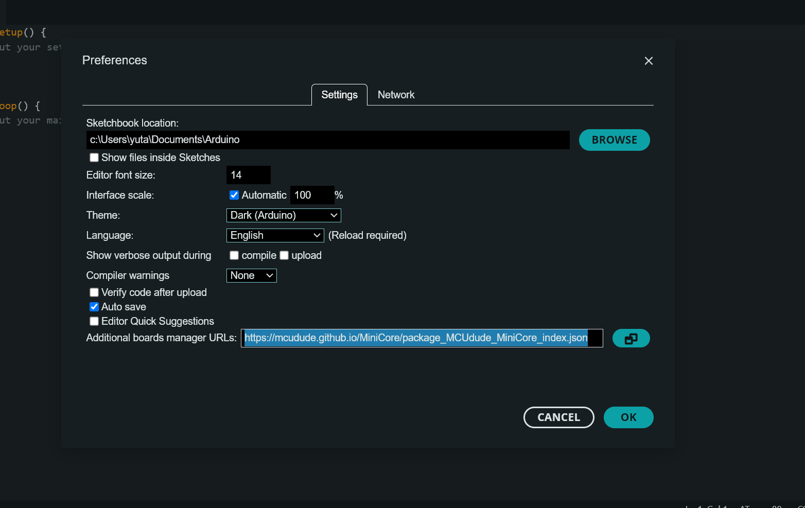
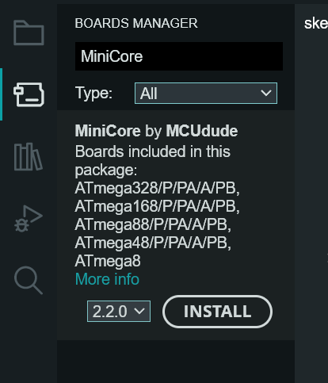
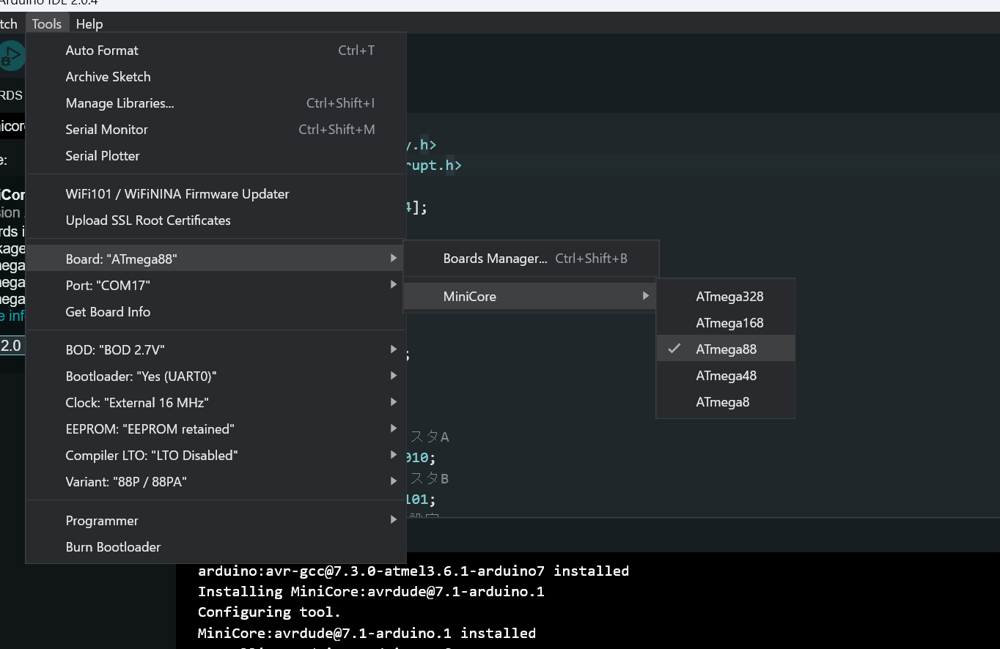
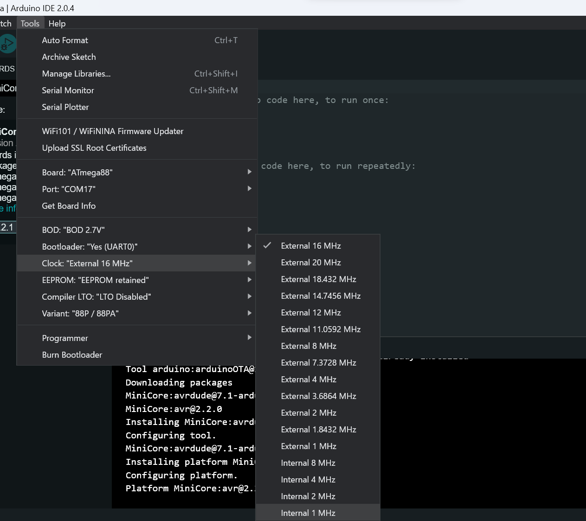
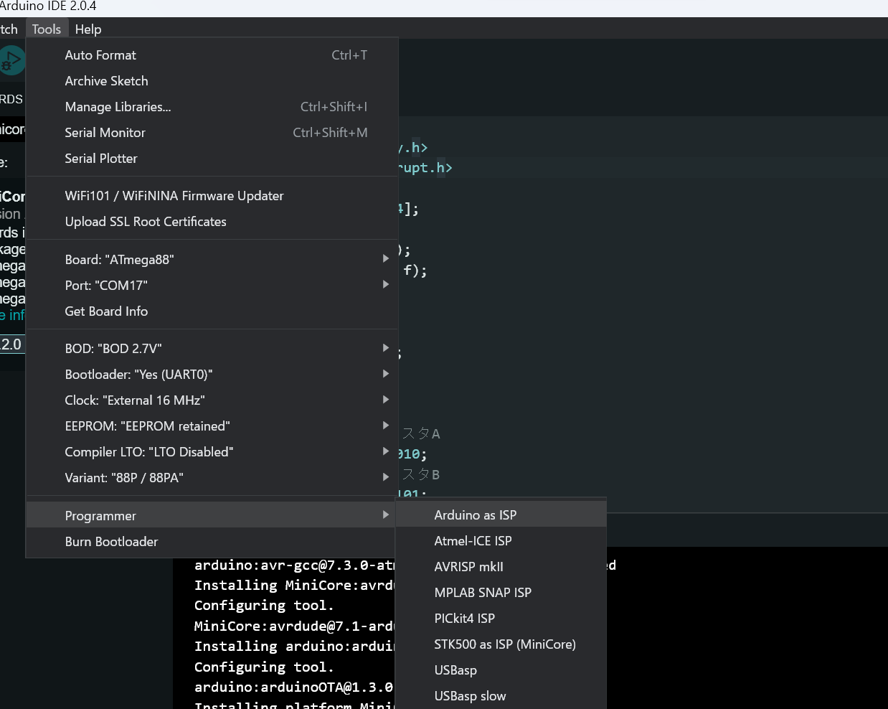
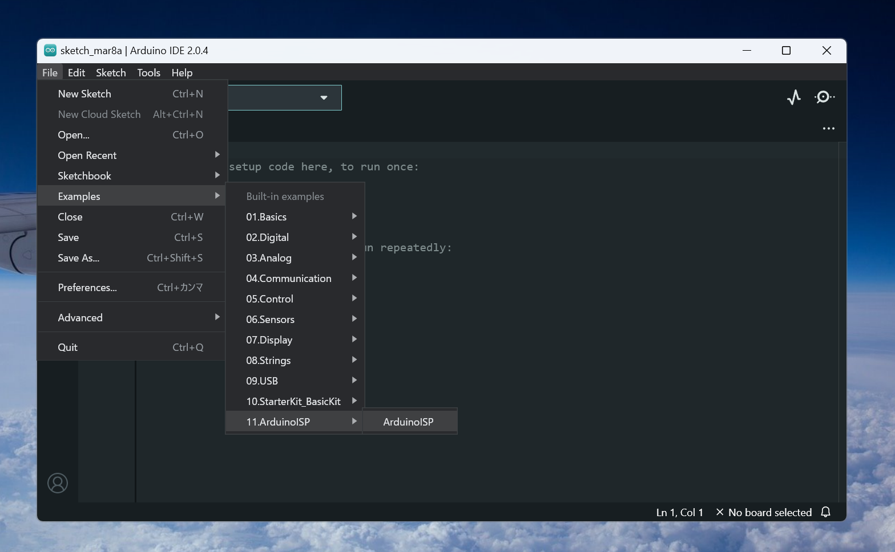

[前回](../day0)の続きです。

---

# 目次

* [はじめに(ハードウェア編)](../day0/)
* はじめに(ソフトウェア編)　←ここ
* [第1回 レジスタとLチカ](../day1/)
* [第2回 7セグメントLED](../day2/)
* [第3回 ダイナミック点灯](../day3/)
* [第4回 タイマ割り込み](../day4/)
* [第5回 サーミスタとAD変換](../day5/)

---
## 4. 開発環境の構築

### 4.1. Arduinoをインストール

https://www.arduino.cc/en/software からArduino IDEをダウンロード&インストールしてください。


### 4.2. Board Managerを管理する

Arduino IDEを開いてPreferencesを開いてください。以下のような画面になると思います。


写真のように、`Additional board manager URLs:`の欄に```https://mcudude.github.io/MiniCore/package_MCUdude_MiniCore_index.json```を追加してください。
終わったら`OK`を押します。



次に右のボードのアイコンをクリックしてみましょう。上のようなものが出るはずです。`BOARD MANAGER`の欄に`MiniCore`と入力すると画像のように表示されるでしょう。
終わったら`INSTALL`を押してください。

### 4.3. コンパイラ、ライターの設定


まず、Tools > Board > MiniCore > ATmega88 と選択していってください。



次に、画像のように、Tools > Clock > Internal 1MHz　と選び、クロック周波数を設定します。



最後に、 Tools > Programmer > Arduino as ISP と選択してください。




以上で環境構築は終わりです。[次回](../day1/)はLチカします。

---

## 5. AVRライターを用意する (おまけ)

AVRマイコンに書き込むためには、AVRライターというものが必要です。ここでは、Arduinoを使ってAVRライターを作ってみます。

### 5.1. ファームウェアを書き込む

まず、Arduino IDEを起動してください。

起動出来たら、以下の画像のように File > Examples > 11 ArduinoISP > ArduinoISP と選んでください。



そうすると、ArduinoISPのスケッチが開かれると思います。今度はArduinoを接続し、このスケッチをArduinoに書き込みましょう。Ctrl+Uと押せば書き込まれます。

### 5.2. 配線する

ファームウェアを書き込んだArduinoとターゲット側のICが簡単に接続できるように、配線します。

|ピンの名前|Arduino側|ICSP端子側|
|-|-|-|
|GND|GND|4|
|VCC|5V|6|
|RST|D10|3|
|MISO|D11|1|
|MOSI|D12|5|
|SCK|D13|2|
---

## （参考）使うマイコンICについて

2023年のMeisterの作業体験ではATmega88というマイコンICを使います。Arduino UNOに使われているATmega328pの弟分みたいなやつですね。

データシート：[https://ww1.microchip.com/downloads/en/DeviceDoc/ATmega48_88_168_megaAVR-Data-Sheet-40002074.pdf](https://ww1.microchip.com/downloads/en/DeviceDoc/ATmega48_88_168_megaAVR-Data-Sheet-40002074.pdf)

半導体不足の今でも250円程度ととても安いです。
