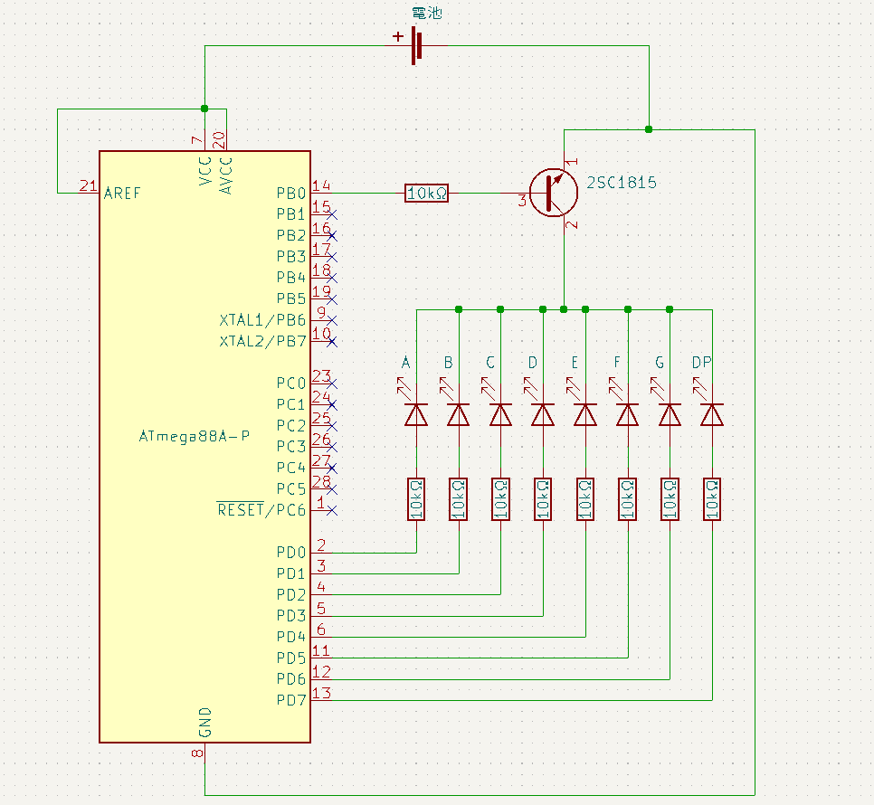
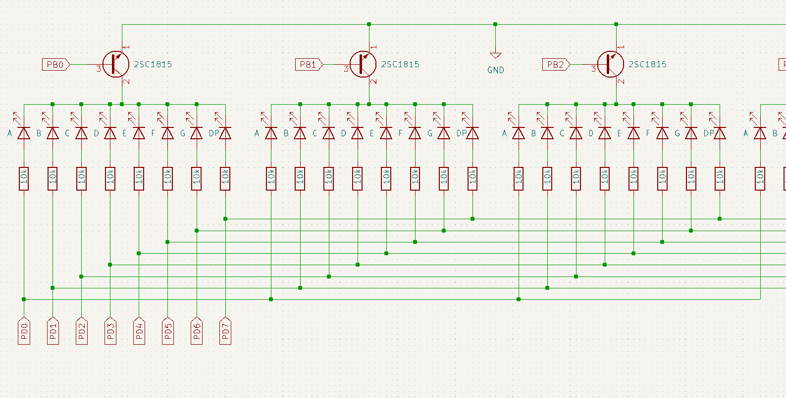

[前回](../day2/)の続きです。今回は７セグで4桁の数字を表示します。

---

# 目次


* [第0回 はじめに(ハードウェア編)](../day0/)
* [第0回 はじめに(ソフトウェア編)](../day0.5/)
* [第1回 レジスタとLチカ](../day1/)
* [第2回 7セグメントLED](../day2/)
* 第3回 ダイナミック点灯　←ここ
* [第4回 タイマ割り込み](../day4/)
* [第5回 サーミスタとAD変換](../day5/)
---

## 16. 前回のプログラムの問題点

[前回](../day2/)は7セグで一桁だけ表示させてみました。[前回](../day2/)の方法で2桁表示しようとすると、 $8\times 2=16$ 本のピンが7セグのために必要になります。4桁では32本のピンが必要になりますが、これはマイコンのピンの数を超えてしまいます。

## 17. ダイナミック点灯

7セグを制御するためのピンの数を減らす方法の一つに**ダイナミック点灯**というものがあります。これについて説明していきます。

1. 1桁目**だけ**を点灯します。この状態で5ms程度待ちます。
2. 2桁目**だけ**を点灯します。この状態で5ms程度待ちます。
3. 3桁目**だけ**を点灯します。この状態で5ms程度待ちます。
4. 4桁目**だけ**を点灯します。この状態で5ms程度待ちます。

1.~4.を繰り返し実行します。すると、各桁の残像が見えるため、4桁全てが点灯しているように見えます。

## 18. トランジスタ



これは、[前回](../day2/)の回路図です。[前回](../day2/)では7セグのカソード(-側)とGNDの接続をPB0で制御しました。

PB0につながっているのは2SC1815というトランジスタです。トランジスタには２種類の役割があります。**増幅作用**と**スイッチング作用**です。

トランジスタには３本のピン（エミッタ、コレクタ、ベース）があります。**増幅作用**とは、ベースに少し電流を流すことで、エミッタとコレクタの間にたくさん電流を流す働きです。

**スイッチング作用**は電子回路上でのスイッチ。上の回路ではスイッチング作用を使っています。

下図は、今回使う回路図の7セグの部分を抜き出したものです。



各桁のA~DPはPORTDに接続されていて、各桁のカソード側とGNDの接続はPORTBのピン(PB0,PB1,PB2,PB3)で制御します。

例えば、以下のコードを実行すると、２桁目に「7」が表示されます。

```cpp
PORTD=0x07
PORTB=0x02
```
## 19. プログラム

では、1秒ごとに9999からカウントダウンするプログラムを作ってみましょう。

### 19.1. ヒント

* 今回はPORTDはPD0～PD7まで8ピン、PORTBのPB0～PB3までの4ピンを使います。そのため、レジスタの値を以下のように設定します。

|ビット|7|6|5|4|3|2|1|0|
|:-:|:-:|:-:|:-:|:-:|:-:|:-:|:-:|:-:|
|DDRD|PD7|PD6|PD5|PD4|PD3|PD2|PD1|PD0|
|値|1|1|1|1|1|1|1|1|

|ビット|7|6|5|4|3|2|1|0|
|:-:|:-:|:-:|:-:|:-:|:-:|:-:|:-:|:-:|
|DDRB|-|PB6|PB5|PB4|PB3|PB2|PB1|PB0|
|値|-|0|0|0|1|1|1|1|

* 例えば、変数numを10進数で表したときの二桁目の数dは、1000で割った余りを100で割ったときの商です。つまり
```cpp
int d=(num%1000)/100;
```
* [前回](../day2/)作った配列は今回も使えます。例えば、3桁目に7を表示させたいのであれば、以下のコードでできます。
```cpp
const unsigned char digit[]={0x3F,0x06,0x5B,0x4F,0x66,0x6D,0x7D,0x07,0x7F,0x6F};
PORTB=1<<2;
PORTD=digit[7];
```
* _delay_ms()で指定した時間(ms)だけ待機することができます。

### 19.2. プログラム例

<details>

```cpp
#include<avr/io.h>
#include<util/delay.h>

unsigned char buf[4];

void display(int i);
void displayDigit();

int main(void){
    DDRD=0xFF;
    PORTD=0b00000000;
    DDRB=0x0F;
    PORTB=0x00;

    int i=9999;
    while(1){
        i--;
        if(i<0){
            i=9999;
        }
        display(i);
        for(int d=0;d<20;d++){
            displayDigit();
            _delay_ms(5);
        }
    }
    return 0;
}

void display(int i){
	const unsigned char digit[]={0x3F,0x06,0x5B,0x4F,0x66,0x6D,0x7D,0x07,0x7F,0x6F};
	/*ピンの接続:
	 * PORTD:
	 * 	0 -> A		
	 * 	1 -> B		    A
	 * 	2 -> C		  +---+
	 * 	3 -> D		F | G |B
	 * 	4 -> E		  +---|
	 * 	5 -> F		E |   |C
	 * 	6 -> G		  +---+ .
	 * 	7 -> DP		    D   DP
	 * */
	i=i%10000;
	buf[3]=digit[i%10];
	buf[2]=digit[(i%100)/10];
	buf[1]=digit[(i%1000)/100];
	buf[0]=digit[i/1000];
}

void displayDigit(){
	static int sw=0;
	sw=(sw+1)%4;
	PORTB=1<<sw;
	PORTD=buf[sw];
}

```
</details>

### 19.3. プログラムの解説

* 4行目：bufには各桁のPORTDの値を入れておきます。buf[3]には一の位、buf[2]には十の位、buf[1]には百の位、buf[0]には千の位のPORTDの値を入れておきます。
* 10~13行目：入出力モード選択レジスタの設定（ヒント参照）
* 15行目：変数iの値を表示します。
* 17~20行目：一秒ごとにiを更新します。
* 21行目：display(i)でbufの値をセットします。
* 22~25行目：displayDigit()で点灯する桁を切り替えます。
* 30~48行目：iの値に合わせて、bufの値をセットする関数です。
    * digitは[前回](../day2/)のものをそのまま使いました。
    * `i%10`で一の位、`(1%100)/10`で十の位、`(i%1000)/100`で百の位、`(i%10000)/1000`で千の位を計算できます。
* 50~55行目：点灯する桁を切り替える関数です。
    * `1<<sw`でsw番目のビットだけを1にすることができます。
    * swは0,1,2,3,1,...と変化していきます。
    * 53,54行目に関しては、ヒントを参照してください。

---

今回はここで終了です。[次回](../day4/)はタイマ割り込みをします。