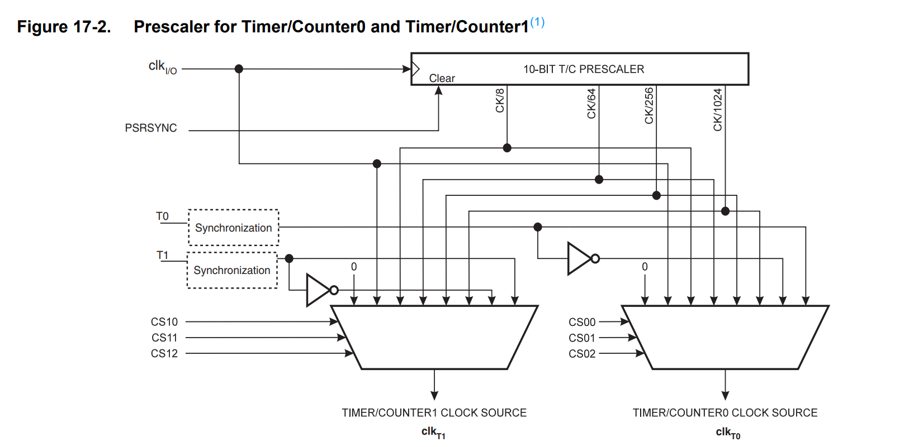
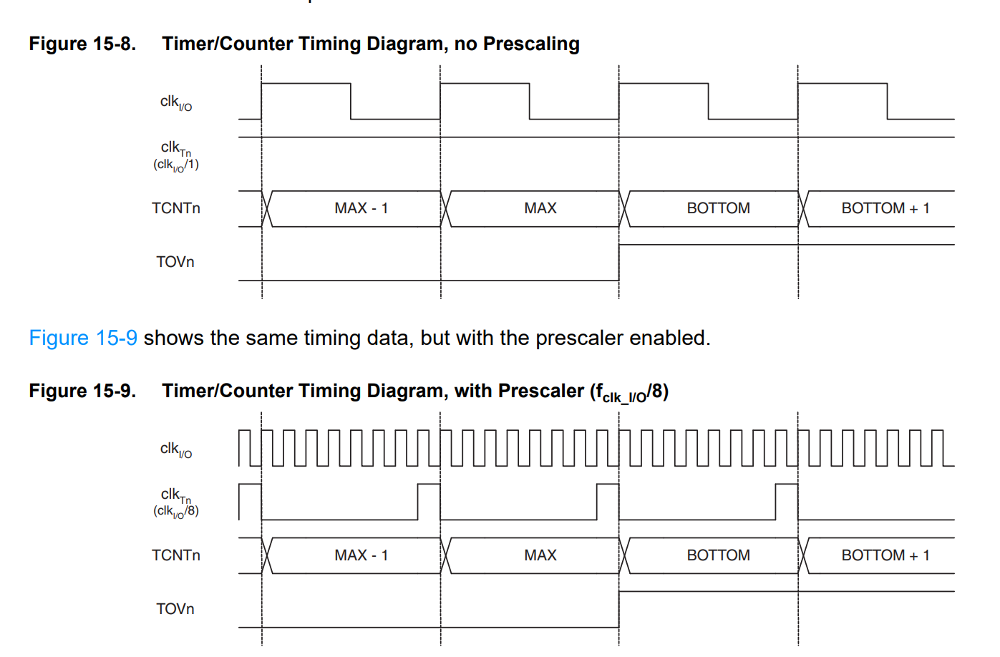
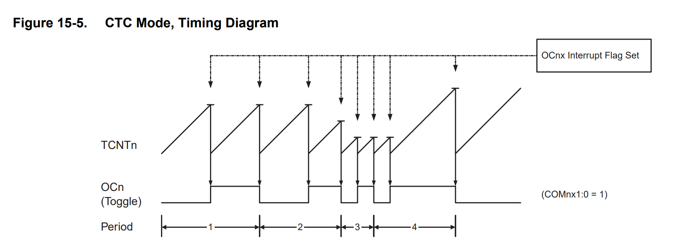
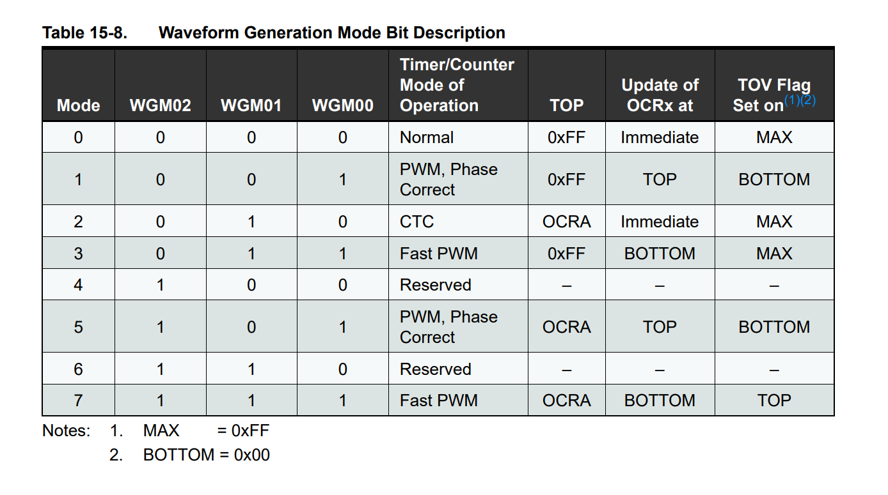
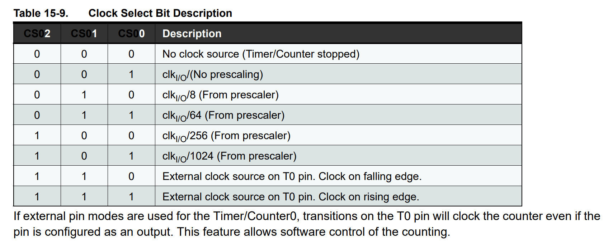

[前回](https://github.com/TitechMeister/Device-ATmega88_Board/tree/main/docs/day3/)の続きです。今回はタイマ割り込みを使って数字を表示します。。

---

# 目次

* [はじめに(ハードウェア編)](https://github.com/TitechMeister/Device-ATmega88_Board/tree/main/docs/day0/)
* [はじめに(ソフトウェア編)](https://github.com/TitechMeister/Device-ATmega88_Board/tree/main/docs/day0.5/)
* [第1回 レジスタとLチカ](https://github.com/TitechMeister/Device-ATmega88_Board/tree/main/docs/day1/)
* [第2回 7セグメントLED](https://github.com/TitechMeister/Device-ATmega88_Board/tree/main/docs/day2/)
* [第3回 ダイナミック点灯](https://github.com/TitechMeister/Device-ATmega88_Board/tree/main/docs/day3/)
* 第4回 タイマ割り込み ←ここ
* [第5回 サーミスタとAD変換](https://github.com/TitechMeister/Device-ATmega88_Board/tree/main/docs/day5/)

---

## 20. 前回のプログラムの問題点

[前回](https://github.com/TitechMeister/Device-ATmega88_Board/tree/main/docs/day3/)は7セグで4桁の数字を表示しました。しかし、前回の方法だと7セグを点灯している間は他の処理ができなくなってしまいます。これは、点灯した後に5ms待機する処理をCPU側でやってしまっているためです。今回は、**タイマ割り込み**というものを使ってこの問題を解決します。

## 21. タイマ割り込み

CPUはクロックの合図に合わせて演算を行います。前回のプログラムでは、5ms経過することをCPU側でクロックを数えていました。タイマカウンタは、クロックが何回数えたかを教えてくれる部品です。
タイマカウンタが数えた値がある値になったとき、CPUの処理を中断して特定の処理が実行されます。このように、CPUの処理を中断させて特定の処理を実行することを**割り込み**といいます。
タイマ割り込みをすることによって。一定時間待つという処理をCPUとは独立に行うことができます。

### 21.1. タイマカウンタの使い方



今回使うAVRマイコンにはタイマが3つあります。ここではTIMER0を使います。

クロックからパルス波を一つ受け取るごとに、タイマカウンタは一つずつ数え上げていきます。TIMER0は8bitなので0~255の256回数え上げることができます。

### 21.2. プリスケーラ

ATmega88のクロック周波数は1MHzだから、このままだと128μsしか数えることができません。そこで使うのが**プリスケーラ**です。

**プリスケーラ**はタイマの分解能を変える部品です。例えば、タイマの分解能を1/1024にすれば、128msまで数えることができます。



### 21.3.  タイマのモード

何も設定しなければ、256まで数えたときに割り込みが発生します。しかし、これでは8msごとにしか割り込みできません。



タイマの割り込みのタイミングはいくつか存在します。そのうち、コンペアマッチAは、カウンタがレジスタOCR0Aに達したとき割り込みが発生します。

今回は、OCR0Aに160を入れれば5msごとに割り込みが発生します。このように、最大値まで行かなくてもタイマが0になるモードを**CTCモード**といいます。

## 22. レジスタの設定

では、具体的にどのようなプログラムを書けばよいのか解説します。

### 22.1. Timer/Counter Control Register

|TCCR0A|7|6|5|4|3|2|1|0|
|:-:|:-:|:-:|:-:|:-:|:-:|:-:|:-:|:-:|
|ビット名|COM0A1|COM0A0|COM0B1|COM0B0|-|-|**WGM01**|**WGM00**|
|値|0|0|0|0|0|0|1|0|


|TCCR0B|7|6|5|4|3|2|1|0|
|:-:|:-:|:-:|:-:|:-:|:-:|:-:|:-:|:-:|
|ビット名|FOC0A|FOC0B|-|-|**WGM02**|**CS02**|**CS01**|**CS00**|
|値|0|0|0|0|0|1|0|1|

上の二つのレジスタはセットで考えます。

まず、`WGM02`、`WGM01`、`WGM00`はタイマの動作モードを指定するビットです。



* Normalモード は標準のモードで、最大値255(=0xFF)まで数え上げます。
* PWM,Phase Correct は三角波のPWMを出力します。
* Fast PWM　はのこぎり波のPWMを出力します。
* CTC が今回使うモードで、OCR0Aに達したらタイマを0にセットします。

次に、`CS02`,`CS01`,`CS00`はプリスケーラを設定するビットです。



今回はプリスケーラを使わないので、二行目（つまり0,0,1）で設定します。

## 22.2. Timer/Counter Interrupt Mask Register

|TIMSK0|7|6|5|4|3|2|1|0|
|:-:|:-:|:-:|:-:|:-:|:-:|:-:|:-:|:-:|
|ビット名|-|-|-|-|-|**OCIE0B**|**OCIE0A**|**TOIE0**|
|値|0|0|0|0|0|0|1|0|

`TIMSK0`は割り込みの種類を選択するレジスタです。

* TOIE0=1ならオーバーフロー割り込みが有効
* OCIE0A=1ならコンペアマッチA割り込みが有効
* OCIE0B=1ならコンペアマッチB割り込みが有効

今回はコンペアマッチA割り込みを有効にしたいので、
```cpp
TIMSK0=0x02
```
とします。

## 22.3. 割り込みハンドラ

割り込みで呼び出される処理は
```cpp
ISR(TIMER0_COMPA_vect){
	/* 処理 */
}
```
に書きます。また、割り込みを許可するためには
```cpp
sei();
```
とsei関数を呼び出します。

##  23. プログラム

```cpp
#include<avr/io.h>
#include<util/delay.h>
#include<avr/interrupt.h>

unsigned char buf[4];

void display(int i);

int main(void){
	DDRD=0xFF;
	PORTD=0b00000000;
	DDRB=0x0F;
	PORTB=0x00;

	//timer0 制御レジスタA
	TCCR0A = 0b00000010;
	//timer0 制御レジスタB
	TCCR0B = 0b00000101;
	//timer0 割り込み設定
	TIMSK0 = 0b00000010;
	OCR0A=4;
	//割り込みを許可
	sei();
	int i=0;
	while(1){
		i--;
        if(i<0){
            i=9999;
        }
		display(i);
		_delay_ms(1000);
	}
	return 0;
}

void display(int i){
	const unsigned char digit[]={0x3F,0x06,0x5B,0x4F,0x66,0x6D,0x7D,0x07,0x7F,0x6F};
	/*ピンの接続:
	 * PORTD:
	 * 	0 -> A		
	 * 	1 -> B		    A
	 * 	2 -> C		  +---+
	 * 	3 -> D		F | G |B
	 * 	4 -> E		  +---|
	 * 	5 -> F		E |   |C
	 * 	6 -> G		  +---+ .
	 * 	7 -> DP		    D   DP
	 * */
	i=i%10000;
	buf[3]=digit[i%10];
	buf[2]=digit[(i%100)/10];
	buf[1]=digit[(i%1000)/100];
	buf[0]=digit[i/1000];
}

ISR(TIMER0_COMPA_vect){
	static int sw=0;
	sw=(sw+1)%4;
	PORTB=1<<sw;
	PORTD=buf[sw];
}
```

今回はここまでです。[次回](https://github.com/TitechMeister/Device-ATmega88_Board/tree/main/docs/day5/)はいよいよ温度計を作ります。